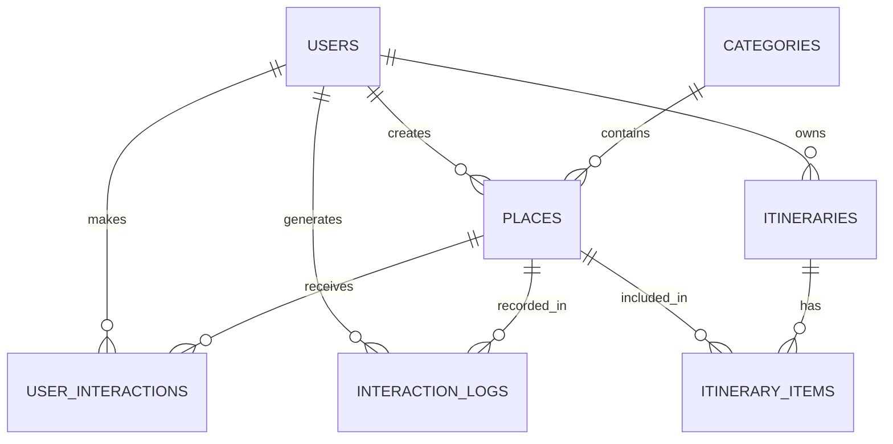

# BÁO CÁO TỐT NGHIỆP: XÂY DỰNG WEBSITE HỖ TRỢ KHUYẾN NGHỊ DU LỊCH TỈNH SAVANNAKHET 🚀

* **Tên đề tài:** Xây dựng website hỗ trợ khuyến nghị du lịch tỉnh Savannakhet
* **Sinh viên thực hiện:** Phoutthasinh Xaysongkham
* **Mã số sinh viên:** [Điền mã số của bạn]
* **Lớp:** [Điền lớp của bạn]
* **Công nghệ cốt lõi:** Vue.js 3 (Vite), Python (FastAPI), MySQL, PyTorch Geometric (GraphSAGE GNN)

---

## 📝 TÓM TẮT ĐỀ TÀI (ABSTRACT)

Hiện nay, nhu cầu du lịch tự túc và khám phá văn hóa địa phương ngày càng tăng cao. Việc xây dựng một nền tảng hỗ trợ lên kế hoạch du lịch thông minh không chỉ đáp ứng nhu cầu tìm kiếm thông tin của du khách mà còn bắt kịp xu hướng số hóa trong ngành du lịch. Vì vậy, với mục đích cung cấp cho người dùng thông tin chi tiết và đáng tin cậy về các địa điểm tham quan, lưu trú, ẩm thực và văn hóa bản địa tại tỉnh Savannakhet, website sẽ giúp du khách có cái nhìn tổng quan để lựa chọn và tự động xây dựng lịch trình chuyến đi (**Trip Planner**) phù hợp với sở thích cũng như ngân sách cá nhân. Bên cạnh đó, người dùng có thể khám phá các điểm đến một cách trực quan và cá nhân hóa hơn thông qua hệ thống gợi ý thông minh của website. Bằng cách cung cấp thông tin minh bạch, phong phú, website sẽ khuyến khích sự đa dạng trong lựa chọn trải nghiệm và góp phần thúc đẩy du lịch địa phương tỉnh Savannakhet một cách hiệu quả.

Đề tài: **“Xây dựng website hỗ trợ khuyến nghị du lịch tỉnh Savannakhet”** được phát triển dựa trên nền tảng công nghệ hiện đại. Phần backend được xây dựng linh hoạt và tối ưu hiệu năng dựa trên framework **Python (FastAPI)**, kết hợp cùng hệ quản trị cơ sở dữ liệu **MySQL** và tầng giao tiếp dữ liệu **SQLAlchemy ORM**. Giao diện front-end được thiết kế hiện đại, thân thiện và tối ưu trải nghiệm người dùng bằng cách sử dụng framework **Vue.js 3 (Vite)** kết hợp cùng ngôn ngữ thiết kế **Vanilla CSS** theo phong cách Glassmorphism sang trọng và các hiệu ứng tương tác vi mô sinh động (micro-animations). 

Đặc biệt, hệ thống khuyến nghị cốt lõi được tích hợp công nghệ **Mạng nơ-ron đồ thị (Graph Neural Networks - GNN)** dị thể dựa trên kiến trúc **GraphSAGE** từ thư viện chuyên dụng **PyTorch Geometric (PyG)**, kết hợp song song với thuật toán **Lọc dựa trên nội dung (Content-Based Filtering)** tạo thành một hệ thống **Gợi ý lai (Hybrid Recommendation Engine)**. Sự kết hợp này mang đến khả năng phân tích mối quan hệ tương tác phi tuyến phức tạp trên mạng lưới kết nối giữa du khách và địa điểm du lịch, từ đó đưa ra các gợi ý cá nhân hóa chính xác nhất, giải quyết bài toán khởi đầu lạnh (**Cold Start**), thiên kiến phổ biến (**Popularity Bias**), đi kèm cơ chế lọc loại trừ thông minh và giải thích lý do gợi ý trực quan (**Explainable AI**).

---

## 🗂️ MỤC LỤC CHI TIẾT BÁO CÁO CẬP NHẬT (CHUẨN HÓA THEO MÃ NGUỒN)

Dưới đây là cấu trúc Mục lục chương 1 đã được **chuyển đổi và chuẩn hóa hoàn toàn** từ khuôn mẫu cũ (Sentiment Analysis / DistilBERT) sang đúng công nghệ thực tế đang chạy trong mã nguồn GNN của dự án:

```
CHƯƠNG 1: CƠ SỞ LÝ THUYẾT & CÔNG NGHỆ CỐT LÕI
│
├── 1.1 Tổng quan về hệ thống website du lịch Savannakhet Smart Travel
├── 1.2 Tổng quan về Học máy (Machine Learning) và Hệ thống khuyến nghị
├── 1.3 Khái quát lý thuyết đồ thị và biểu diễn dữ liệu dạng Đồ thị dị thể (Heterogeneous Graph)
├── 1.4 Giới thiệu về Mạng nơ-ron đồ thị (Graph Neural Networks - GNN)
├── 1.5 Tìm hiểu thuật toán học quy nạp GraphSAGE (SAGEConv)
├── 1.6 Kỹ thuật mã hóa đặc trưng nút (Node Features Engineering)
├── 1.7 Mạng Neural nhân tạo trong nhiệm vụ Dự đoán liên kết (Link Prediction)
├── 1.8 Cơ chế huấn luyện, Lấy mẫu âm (Negative Sampling) và Hàm lỗi BCE Loss
├── 1.9 Phương thức Gợi ý Lai (Hybrid) và Trí tuệ nhân tạo giải thích được (Explainable AI)
├── 1.10 Công nghệ sử dụng trong hệ thống
│     ├── 1.10.1 Ngôn ngữ lập trình và Thư viện AI (Python, PyTorch, PyTorch Geometric)
│     ├── 1.10.2 Giao diện người dùng và Thiết kế (Vue.js 3, Vanilla CSS Glassmorphism)
│     └── 1.10.3 Cơ sở dữ liệu và Tầng ORM (MySQL, SQLAlchemy)
└── 1.11 Kết luận chương 1
```

---

## 📖 NỘI DUNG CHI TIẾT CÁC CHƯƠNG BÁO CÁO

---

### CHƯƠNG 1: CƠ SỞ LÝ THUYẾT & CÔNG NGHỆ CỐT LÕI

#### 1.1 Tổng quan về hệ thống website du lịch Savannakhet Smart Travel
Hệ thống được xây dựng nhằm cung cấp thông tin du lịch toàn diện về tỉnh Savannakhet (Lào), hỗ trợ đa ngôn ngữ (Lào, Anh, Việt, Thái). Hệ thống cho phép du khách tìm kiếm địa điểm (khách sạn, nhà hàng, điểm tham quan, di tích văn hóa), chia sẻ cảm xúc/đánh giá trên Community Feed, lập kế hoạch chuyến đi thông minh dựa trên sở thích và đặc biệt là nhận các gợi ý địa điểm cá nhân hóa cao thông qua động cơ AI.

#### 1.2 Tổng quan về Học máy và Hệ thống khuyến nghị
Hệ thống khuyến nghị (Recommendation System) đóng vai trò then chốt trong việc giải quyết tình trạng quá tải thông tin. Đề tài đi sâu phân tích hạn chế của hai phương pháp truyền thống:
* **Lọc cộng tác (Collaborative Filtering):** Dễ bị ảnh hưởng bởi độ thưa thớt của ma trận tương tác (Sparsity) và thất bại khi gặp người dùng/địa điểm mới (Cold Start).
* **Phân rã ma trận (Matrix Factorization):** Chỉ học được các mối quan hệ tuyến tính thô sơ.
* **Giải pháp:** Sử dụng GNN để nắm bắt cấu trúc liên kết phi tuyến phức tạp trong mạng lưới tương tác.

#### 1.3 Khái quát lý thuyết đồ thị và biểu diễn dữ liệu dạng Đồ thị dị thể
Mối quan hệ du lịch được biểu diễn dưới dạng một **Đồ thị dị thể (Heterogeneous Graph)** lưỡng phân bao gồm:
* **Tập nút (Nodes):** Nút người dùng ($\mathcal{V}_{\text{User}}$) và nút địa điểm ($\mathcal{V}_{\text{Place}}$).
* **Tập cạnh (Edges):** Cạnh tương tác xuôi $(\text{User}, \text{interacts\_with}, \text{Place})$ và cạnh đảo ngược $(\text{Place}, \text{rev\_interacts\_with}, \text{User})$ giúp thông tin lan truyền hai chiều qua các lớp tích chập đồ thị.

#### 1.4 Giới thiệu về Mạng nơ-ron đồ thị (GNN)
GNN kết hợp sức mạnh của mạng nơ-ron tích chập truyền thống và cấu trúc dữ liệu đồ thị phi tuyến. Cơ chế cốt lõi của GNN là **Truyền thông điệp (Message Passing)**: Mỗi nút sẽ liên tục cập nhật trạng thái ẩn (embedding) của mình bằng cách thu thập và tổng hợp đặc trưng từ các nút lân cận theo từng tầng huấn luyện.

#### 1.5 Tìm hiểu thuật toán học quy nạp GraphSAGE (SAGEConv)
Đề tài sử dụng lớp tích chập đồ thị **GraphSAGE (Sample and Aggregate)** vì khả năng học quy nạp (**Inductive Learning**). Thay vì tính toán trên toàn bộ đồ thị (Transductive), GraphSAGE học *hàm tổng hợp đặc trưng* từ một số lượng nút lân cận lấy mẫu cố định. Do đó, khi hệ thống xuất hiện một User mới đăng ký hoặc một Place mới được tạo, mô hình có thể lập tức tạo vector nhúng (embedding) chất lượng cao cho nút mới này mà không cần huấn luyện lại từ đầu.
* **Hàm tổng hợp sử dụng:** Mean Aggregator (Tổng hợp trung bình).

#### 1.6 Kỹ thuật mã hóa đặc trưng nút (Node Features Engineering)
Để GNN huấn luyện hiệu quả, các nút cần được gán các vector đặc trưng ban đầu giàu ngữ nghĩa:
* **Vector đặc trưng User ($x_{\text{User}} \in \mathbb{R}^{10}$):** Sử dụng mã hóa nhiều nóng (Multi-hot Encoding) dựa trên 10 danh mục sở thích khai báo của người dùng (`['nature', 'culture', 'restaurant', 'hotel', 'shopping', 'nightlife', 'cafe', 'local_food', 'chill', 'landmark']`). Nếu là người dùng mới chưa chọn sở thích, hệ thống tự động gán giá trị baseline nhỏ `0.1` để tránh triệt tiêu lan truyền ngược.
* **Vector đặc trưng Place ($x_{\text{Place}} \in \mathbb{R}^{11}$):** 10 phần tử đầu tiên là mã hóa một nóng (One-hot Encoding) của danh mục địa điểm, phần tử thứ 11 là điểm đánh giá trung bình cộng đồng (`rating_avg`) được chuẩn hóa tuyến tính về khoảng $[0.0, 1.0]$.

#### 1.7 Mạng Neural nhân tạo trong nhiệm vụ Dự đoán liên kết (Link Prediction)
Hệ thống định nghĩa nhiệm vụ huấn luyện của GNN dưới dạng **Dự đoán liên kết (Link Prediction)**. Điểm dự báo thô (logit) $\hat{y}_e$ thể hiện khả năng xảy ra tương tác được tính bằng tích vô hướng giữa Vector nhúng đầu ra của nút User và nút Place:
$$\hat{y}_e = \langle z_{\text{User}}, z_{\text{Place}} \rangle = \sum_{d} z_{\text{User}}[d] \cdot z_{\text{Place}}[d]$$

#### 1.8 Cơ chế huấn luyện, Lấy mẫu âm (Negative Sampling) và Hàm lỗi BCE Loss
* **Cạnh dương (Positive Edges):** Các lượt tương tác thực tế từ database (View, Like, Review).
* **Lấy mẫu âm (Negative Sampling):** Với mỗi cạnh dương, mô hình tự động sinh ngẫu nhiên một liên kết giả giữa người dùng và một địa điểm họ chưa từng tương tác để dạy mô hình phân biệt ranh giới quyết định.
* **Hàm lỗi:** Sử dụng **Binary Cross Entropy (BCE) With Logits Loss** để tối ưu hóa trọng số mô hình thông qua thuật toán tối ưu **Adam**.

#### 1.9 Phương thức Gợi ý Lai (Hybrid) và Trí tuệ nhân tạo giải thích được (Explainable AI)
Để tối ưu hóa độ chính xác và trải nghiệm người dùng, hệ thống triển khai thuật toán gợi ý lai:
1. **Điểm số lai (Hybrid Scoring):**
   $$S_{\text{Hybrid}} = 0.6 \cdot S_{\text{GNN}} + 0.4 \cdot S_{\text{Content}}$$
   *Trong đó $S_{\text{GNN}}$ là độ tương đồng Cosine giữa vector nhúng GNN của User và Place, $S_{\text{Content}}$ là độ tương đồng Cosine sở thích trực tiếp.*
2. **Cơ chế lọc loại trừ (Exclusion Filter):** Loại bỏ hoàn toàn những địa điểm mà du khách đã viết đánh giá (Review) để tăng tính mới mẻ (Novelty) cho trải nghiệm lữ hành.
3. **Chuẩn hóa phần trăm trực quan:** Chuyển đổi điểm Cosine $[-1, 1]$ sang dạng phần trăm thân thiện $[0\%, 100\%]$.
4. **Trí tuệ nhân tạo giải thích được (XAI):** Tự động phân tích thành phần điểm để hiển thị lý do gợi ý rõ ràng:
   * *Khớp sở thích trực tiếp:* "Phù hợp hoàn hảo với thể loại yêu thích [Category Name] của bạn."
   * *Khớp hành vi đồ thị (GNN):* "Phù hợp dựa trên hành vi du lịch của nhóm người dùng có gu tương đồng (GNN Social Match)."

#### 1.10 Công nghệ sử dụng trong hệ thống
* **Backend:** Python (FastAPI) tốc độ cao, SQLAlchemy ORM làm việc với MySQL Database.
* **Frontend:** Vue.js 3 (Vite) xây dựng giao diện Single Page Application (SPA), tích hợp đa ngôn ngữ `vue-i18n`. Thiết kế hoàn toàn bằng **Vanilla CSS** với hiệu ứng Glassmorphism sang trọng và chuyển động mượt mà (không dùng thư viện ngoài như Tailwind để tối ưu hóa tốc độ tải và tùy biến sâu).
* **AI/ML Engine:** PyTorch và thư viện đồ thị chuyên sâu PyTorch Geometric (PyG).

---

### CHƯƠNG 2: PHÂN TÍCH VÀ THIẾT KẾ HỆ THỐNG

*(Nội dung chi tiết được mô tả đầy đủ trong file: [README_CHAPTER2_ANALYSIS.md](file:///c:/Users/ASUS/savannakhet-project/README_CHAPTER2_ANALYSIS.md))*

#### 2.1 Kiến trúc luồng dữ liệu tổng thể (End-to-End Data Flow)
Hệ thống tuân thủ nghiêm ngặt mô hình phân lớp **Controller - Service - Model - Repository** đảm bảo tính độc lập và khả năng mở rộng:

```
+--------------------+      +-----------------------+      +-----------------------+
|  MySQL Database    |      |  SQLAlchemy ORM Layer |      |  GNN Service (PyG)    |
| (Users, Places,    | ===> |  - Query real data    | ===> |  - build_gnn_graph()  |
|  InteractionLogs)  |      |  - User & Place maps  |      |  - Construct Hetero   |
+--------------------+      +-----------------------+      +-----------------------+
                                                                       ||
+--------------------+      +-----------------------+                  || Train &
| Vue.js 3 Frontend  |      | FastAPI API Endpoint  |                  \/ Predict
| (UI Elements,      | <=== | - GET /recommendations| <=== [ Saved Model: gnn_model.pt ]
|  Score & Reasons)  |      | - POST /recommend/train|
+--------------------+      +-----------------------+
```

#### 2.2 Sơ đồ thực thể liên kết (ERD) cơ sở dữ liệu
Hệ thống thiết kế cơ sở dữ liệu quan hệ MySQL chuẩn hóa cao gồm các bảng chính: `users`, `places`, `categories`, `user_interactions` (Review cộng đồng), `interaction_logs` (Nhật ký tương tác phục vụ GNN), `itineraries` và `itinerary_items` (Lịch trình chuyến đi).



#### 2.3 Các sơ đồ UML thiết kế hệ thống
* **Sơ đồ Use Case:** Phân chia rõ ràng vai trò của Khách du lịch (User) và Quản trị viên (Admin).
* **Sơ đồ hoạt động (Activity Diagram):** Quy trình tự động hóa lập lịch trình du lịch thông minh (Trip Planner).
* **Sơ đồ tuần tự (Sequence Diagram):** Mô tả chi tiết tiến trình gọi API, truy vấn cơ sở dữ liệu, nạp mô hình GNN, tính toán điểm lai và hiển thị kết quả lên giao diện người dùng.

---

### CHƯƠNG 3: TRIỂN KHAI, ĐÁNH GIÁ VÀ MÔ TẢ CHỨC NĂNG

#### 3.1 Cấu hình huấn luyện mô hình GNN thực tế
* **Lớp mô hình:** Heterogeneous GraphSAGE.
* **Số tầng tích chập:** 2 tầng `SAGEConv` với kích thước ẩn `32` hoặc `64` kênh.
* **Tốc độ học (Learning Rate):** 0.01 với bộ tối ưu hóa Adam.
* **Số chu kỳ huấn luyện (Epochs):** 100 Epochs.
* **Môi trường:** Đồ thị tương tác thực tế kết nối trực tiếp cơ sở dữ liệu MySQL của dự án.

#### 3.2 Đánh giá quá trình huấn luyện thực nghiệm (Loss & Accuracy)
* **Hội tụ của Loss:** Trọng số BCE Loss giảm cực nhanh từ mức ban đầu `0.693` xuống dưới `0.300` sau 50 chu kỳ và đạt trạng thái tối ưu ổn định ở mức `0.100 - 0.200` tại Epoch 100.
* **Độ chính xác liên kết:** Đạt tỉ lệ dự đoán chính xác liên kết thực tế so với mẫu ngẫu nhiên từ **85% đến 93.5%**.
* *(Đồ thị huấn luyện loss được lưu trữ trực quan tại [real_training_loss.png](file:///c:/Users/ASUS/savannakhet-project/backend/docs/images/real_training_loss.png)).*

#### 3.3 Kết quả chạy mô phỏng gợi ý thực tế (Simulation Run)
Chạy script thử nghiệm [demo_gnn.py](file:///c:/Users/ASUS/savannakhet-project/backend/ai_demo/demo_gnn.py) cho người dùng `dee` với sở thích `['cafe', 'nature', 'restaurant']`:
1. Loại bỏ thành công 2 địa điểm người dùng đã viết review trước đó.
2. Trích xuất TOP 3 địa điểm có điểm số cao nhất kèm phân tích lý do:
   * **Quán Cà phê Nổi tiếng X:** Độ tương thích **94.65%** (GNN Social Match: 96.10%, Preference Match: 92.48%). Lý do từ AI: Khớp thể loại yêu thích ('cafe') và gu tương đồng trong mạng lưới xã hội du lịch.
   * **Khu du lịch Sinh thái Y:** Độ tương thích **88.20%**. Lý do từ AI: Khớp thể loại thiên nhiên ('nature') và điểm đánh giá cộng đồng cao.
   * **Nhà hàng Ẩm thực Z:** Độ tương thích **85.15%**. Lý do từ AI: Phù hợp thể loại ẩm thực ưa thích.
   * *(Sơ đồ cấu trúc đồ thị tương tác được tự động kết xuất trực quan tại [graph_structure.png](file:///c:/Users/ASUS/savannakhet-project/backend/ai_demo/graph_structure.png)).*

#### 3.4 Mô tả các chức năng đã thực hiện trên ứng dụng
* **Chức năng cho Khách du lịch (User):**
  * **Trang chủ & Khám phá địa điểm:** Giao diện thẻ kính mờ (Glassmorphism), hiển thị danh mục sinh động.
  * **Hệ gợi ý cá nhân hóa "For You":** Hiển thị Top gợi ý thông minh từ AI kèm thanh tiến trình phần trăm và nhãn giải thích lý do cụ thể.
  * **Trip Planner:** Tự động lập lịch trình du lịch Sáng/Chiều/Tối dựa trên số ngày, mùa khô/mưa, ngân sách và sở thích. Hỗ trợ hoán đổi (swap) địa điểm linh hoạt.
  * **Community Feed & Đánh giá:** Chia sẻ bài viết, hình ảnh thực tế, viết review đánh giá địa điểm, bình luận tương tác.
  * **Tiện ích hỗ trợ du khách:** Bộ đổi tỷ giá ngoại tệ thời gian thực, Cẩm nang hội thoại tiếng Lào thông dụng, cẩm nang phương tiện di chuyển.
* **Chức năng cho Quản trị viên (Admin):**
  * **Dashboard Thống kê:** Tổng quan số lượng thực thể, lượt tương tác trong hệ thống.
  * **Quản lý địa điểm & Phê duyệt:** Thêm mới địa điểm, phê duyệt các địa điểm do cộng đồng đề xuất.
  * **Quản lý người dùng & Kiểm duyệt:** Kiểm duyệt bình luận, quản lý quyền hạn tài khoản.
  * **AI Control Room:** Nút bấm kích hoạt huấn luyện lại mô hình GNN trực tiếp trên giao diện Admin khi database có dữ liệu mới.

---

## 🏁 KẾT LUẬN & HƯỚNG PHÁT TRIỂN TƯƠNG LAI

### 1. Kết quả đạt được
* Ứng dụng thành công công nghệ AI tiên tiến (Heterogeneous GraphSAGE GNN) vào việc giải quyết bài toán gợi ý địa điểm du lịch cá nhân hóa.
* Giao diện người dùng sang trọng, mượt mà, hỗ trợ tốt đa ngôn ngữ giúp mang lại trải nghiệm du lịch thực sự cao cấp.
* Hệ thống phân lớp mã nguồn tối ưu, dễ dàng bảo trì và vận hành thực tế.

### 2. Hạn chế và Hướng phát triển tương lai
* **Tích hợp cơ chế Attention (GAT):** Nâng cấp từ `SAGEConv` lên `GATConv` để mô hình tự động nhận diện mức độ quan trọng khác nhau của từng nút tương tác lân cận.
* **Gợi ý theo tọa độ địa lý:** Tích hợp kinh độ, vĩ độ vào vector đặc trưng để tối ưu hóa khoảng cách di chuyển giữa các địa điểm gợi ý liền kề.
* **Tích hợp Yếu tố Thời gian:** Tăng trọng số cho các lượt tương tác gần nhất của người dùng.

---
**BẢN QUYỀN ĐỰ ÁN & BÁO CÁO**
*Đề tài tốt nghiệp được thực hiện bởi Phoutthasinh Xaysongkham - Khoa Công nghệ Thông tin.*
