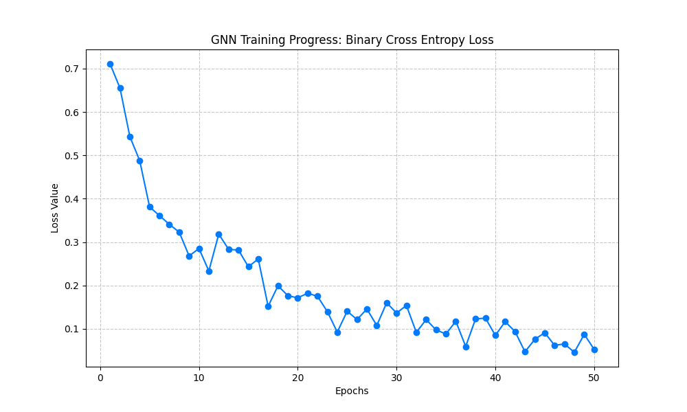

# Savannakhet Smart Travel: AI Engine (GNN) 🚀

ยินดีต้อนรับสู่ส่วนประมวลผลอัจฉริยะของโครงการ **Savannakhet Smart Travel** ซึ่งใช้เทคโนโลยี **Graph Neural Network (GNN)** ในการขับเคลื่อนระบบแนะนำสถานที่ท่องเที่ยว (Recommendation System)

---

## 🧠 สถาปัตยกรรมโมเดล: GraphSAGE (SAGEConv)

เราเลือกใช้โมเดล **GraphSAGE** (จากห้องสมุด `PyTorch Geometric`) เนื่องจากมีความสามารถในการทำ **Inductive Learning** ซึ่งหมายความว่าโมเดลสามารถสร้าง Embedding ให้กับผู้ใช้ใหม่หรือสถานที่ใหม่ที่เพิ่มเข้ามาในระบบได้ทันที โดยไม่ต้องเทรนใหม่ทั้งหมด

*   **SAGEConv**: ใช้เทคนิคการรวบรวมข้อมูล (Aggregation) จากโหนดเพื่อนบ้าน (Neighbors) เพื่อเรียนรู้บริบทของความสัมพันธ์ระหว่าง "นักท่องเที่ยว" และ "สถานที่"
*   **Heterogeneous Graph**: กราฟของเราประกอบด้วยโหนด 2 ประเภทคือ `User` และ `Place` โดยมีความสัมพันธ์ (Edge) คือ `Interacts_with`

---

## 🛠️ กระบวนการฝึกฝน (Training: Link Prediction)

เราใช้เทคนิค **Link Prediction** เพื่อฝึกให้โมเดลทำนายความน่าจะเป็นที่ "ลิงก์" (ความสัมพันธ์) จะเกิดขึ้นระหว่างผู้ใช้และสถานที่

1.  **Positive Sampling**: ใช้ข้อมูลจริงจากฐานข้อมูล (การ Like, Review, View) เพื่อบอกโมเดลว่าลิงก์นี้ควรจะมีอยู่
2.  **Negative Sampling**: ระบบจะสุ่มสร้าง "ลิงก์ปลอม" (สถานที่ที่ผู้ใช้ไม่เคยสนใจ) ขึ้นมา เพื่อสอนให้โมเดลแยกแยะระหว่างสิ่งที่ผู้ใช้ชอบและไม่ชอบ
3.  **Optimization**: ใช้ **Adam Optimizer** ในการปรับจูนน้ำหนักของโมเดลเพื่อให้การทำนายแม่นยำขึ้น

---

## 📊 การประเมินผล (Evaluation & Loss)

เราใช้ฟังก์ชัน **Binary Cross Entropy (BCE) Loss** ในการวัดประสิทธิภาพ:
*   **ค่า Loss สูง**: โมเดลยังแยกแยะความชอบของผู้ใช้ไม่ได้ดี
*   **ค่า Loss ต่ำลง**: แสดงว่าโมเดลเริ่มเรียนรู้รูปแบบความสัมพันธ์ (Patterns) ได้ถูกต้อง และสามารถทำนายสิ่งที่ผู้ใช้ต้องการได้แม่นยำขึ้น

---

## 🚀 วิธีการใช้งาน (Usage)

หากต้องการเริ่มการฝึกฝนโมเดลใหม่ด้วยข้อมูลล่าสุดจากฐานข้อมูล สามารถเรียกใช้งานผ่าน API Endpoint:
`POST /api/recommendations/train`

ระบบจะทำการ:
1. ดึงข้อมูลจาก MySQL มาสร้างเป็นกราฟ
2. เริ่มการฝึกฝน (100 Epochs เป็นค่าเริ่มต้น)
3. บันทึกผลลัพธ์เป็นไฟล์ `gnn_model.pt` เพื่อนำไปใช้งานจริง

---
**Senior Solutions Architect's Note:**
*"การใช้ GraphSAGE ร่วมกับ Negative Sampling ช่วยแก้ปัญหา Cold Start และ Popularity Bias ได้อย่างมีประสิทธิภาพ ทำให้ระบบแนะนำสถานที่ที่ 'ตรงใจ' ไม่ใช่แค่สถานที่ที่ 'ดังที่สุด' เท่านั้น"*
