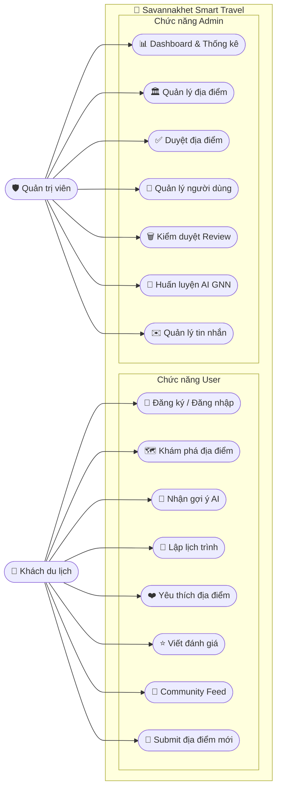
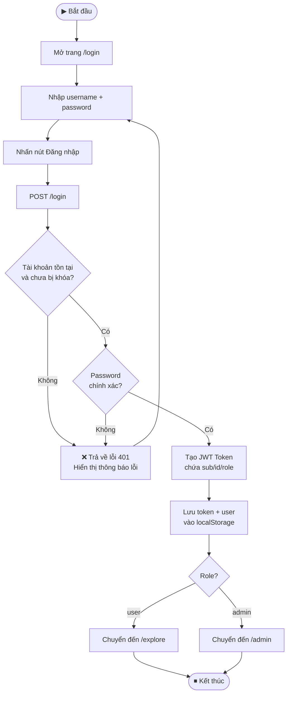
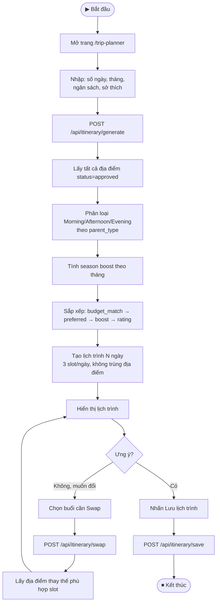
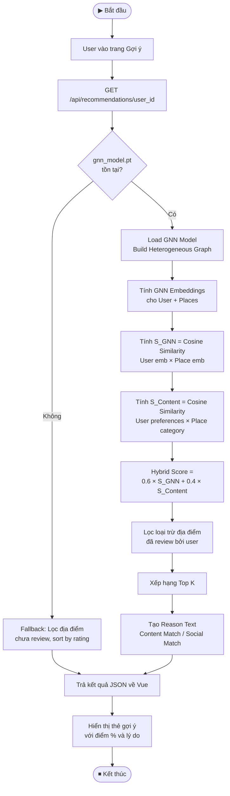
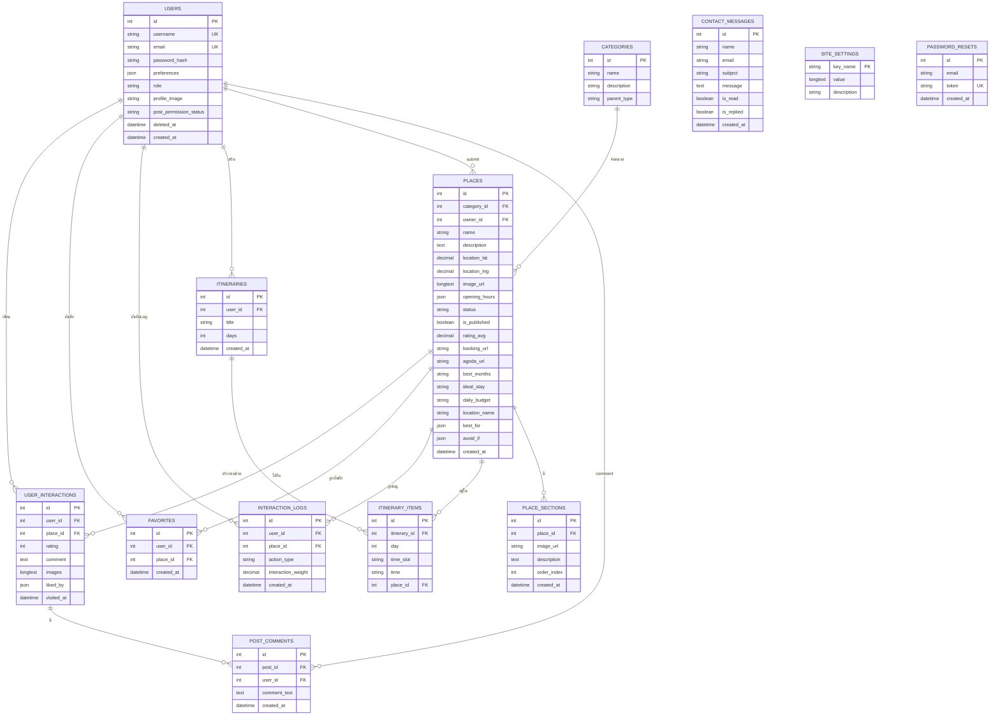

# CHƯƠNG 2: PHÂN TÍCH VÀ THIẾT KẾ HỆ THỐNG

## 2.1. Phân tích yêu cầu hệ thống

### 2.1.1. Mục tiêu của hệ thống

Hệ thống **Savannakhet Smart Travel** là nền tảng du lịch thông minh được xây dựng để số hóa và nâng cao trải nghiệm du lịch tại tỉnh Savannakhet, Lào. Hệ thống hướng đến các mục tiêu cốt lõi sau:

- **Khám phá địa điểm du lịch:** Cung cấp thông tin chi tiết về các địa điểm tham quan, khách sạn, nhà hàng, quán cà phê và điểm nổi tiếng tại Savannakhet
- **Gợi ý thông minh bằng AI (GNN):** Đề xuất địa điểm cá nhân hóa dựa trên sở thích người dùng và lịch sử tương tác thông qua mô hình Mạng nơ-ron đồ thị (GraphSAGE)
- **Lập lịch trình du lịch tự động (Trip Planner):** Tự động tạo lịch trình Sáng/Chiều/Tối theo số ngày, ngân sách, tháng đi và sở thích cá nhân
- **Community & Review:** Xây dựng cộng đồng chia sẻ đánh giá, bình luận và tương tác giữa du khách
- **Đa ngôn ngữ:** Hỗ trợ tiếng Anh, tiếng Lào, tiếng Việt và tiếng Thái

### 2.1.2. Đối tượng sử dụng

Hệ thống phục vụ 2 nhóm đối tượng chính:

| Đối tượng | Mô tả | Quyền hạn |
|-----------|-------|-----------|
| **Khách du lịch (User)** | Du khách trong và ngoài nước muốn khám phá Savannakhet | Đăng ký/đăng nhập, xem địa điểm, nhận gợi ý AI, lập lịch trình, đánh giá, yêu thích |
| **Quản trị viên (Admin)** | Cán bộ quản lý hệ thống | Toàn quyền quản lý nội dung, người dùng, duyệt địa điểm, huấn luyện AI |

### 2.1.3. Yêu cầu chức năng

#### Yêu cầu chức năng cho Khách du lịch (User)

**Xác thực tài khoản:**
- Đăng ký tài khoản với username, email, password và sở thích du lịch (preferences)
- Đăng nhập → nhận JWT Token
- Quên mật khẩu → nhận link reset qua Email (SMTP)
- Đặt lại mật khẩu bằng Token

**Khám phá địa điểm:**
- Xem danh sách địa điểm lọc theo danh mục (Hotels, Restaurants, Nature, Landmarks)
- Xem chi tiết địa điểm: ảnh, mô tả, giờ mở cửa, tọa độ GPS, ngân sách/ngày, tháng lý tưởng
- Xem địa điểm đang được yêu thích (Trending) tính từ interaction_logs
- Xem địa điểm tương tự (Similar Places) qua GNN Embeddings
- Lưu địa điểm yêu thích (Favorites)

**Gợi ý AI (GNN Recommendation):**
- Nhận danh sách gợi ý cá nhân hóa Top K địa điểm
- Xem điểm tương thích (%) và lý do gợi ý (Content Match / Social Match)
- Lọc loại trừ địa điểm đã review

**Lập lịch trình (Trip Planner):**
- Nhập số ngày, tháng khởi hành, ngân sách, sở thích
- Hệ thống tự động tạo lịch theo Sáng (09:00) / Chiều (14:00) / Tối (19:00)
- Hoán đổi (Swap) địa điểm trong từng buổi
- Lưu lịch trình cá nhân

**Community & Review:**
- Viết đánh giá kèm ảnh và điểm số (1–5 ดาว) cho địa điểm
- Đăng bài lên Community Feed
- Bình luận (Comment) bài đăng của người khác
- Thích (Like/Unlike) bài đăng
- Xem lịch sử review của bản thân

**Đóng góp nội dung:**
- Submit địa điểm mới (chờ Admin duyệt, status = pending)
- Yêu cầu quyền đăng bài (post_permission_status = pending)

**Tiện ích:**
- Liên hệ Admin qua form contact
- Xem FAQ và hướng dẫn sử dụng
- Đổi ngôn ngữ giao diện (i18n)

#### Yêu cầu chức năng cho Quản trị viên (Admin)

| Nhóm chức năng | Chi tiết |
|----------------|----------|
| **Dashboard & Thống kê** | Tổng users, places, reviews; thống kê theo danh mục; Top 5 địa điểm |
| **Quản lý địa điểm** | CRUD địa điểm; upload ảnh; quản lý giờ mở cửa, tọa độ, ngân sách |
| **Duyệt địa điểm** | Duyệt/từ chối địa điểm do User submit (pending → approved/rejected) |
| **Quản lý danh mục** | CRUD Category với parent_type phục vụ AI |
| **Kiểm duyệt Review** | Xem và xóa bình luận vi phạm |
| **Quản lý người dùng** | Xem danh sách, soft-delete (khóa 3 ngày), khôi phục tài khoản |
| **Duyệt quyền đăng bài** | Phê duyệt/từ chối yêu cầu quyền đăng bài từ User |
| **Huấn luyện AI** | Kích hoạt huấn luyện lại mô hình GNN qua `POST /admin/gnn/train` |
| **Quản lý tin nhắn** | Xem và phản hồi tin nhắn liên hệ từ Contact Form |
| **Cài đặt hệ thống** | Quản lý Site Settings (site_settings table) |

### 2.1.4. Yêu cầu phi chức năng

| Loại | Yêu cầu |
|------|---------|
| **Bảo mật** | Mật khẩu mã hóa bcrypt; Xác thực JWT Token; Soft-delete User (không xóa thật) |
| **Hiệu năng** | API RESTful FastAPI; Tính toán Trending từ interaction_logs; Caching embedding GNN |
| **Khả năng sử dụng** | Responsive design; Hỗ trợ 4 ngôn ngữ (i18n); Navigation Guard kiểm soát quyền truy cập |
| **Khả năng mở rộng** | SQLAlchemy ORM; Kiến trúc phân lớp rõ ràng; GNN model lưu file `.pt` thay thế được |
| **Tương thích** | Vue 3 + Vite; FastAPI + Uvicorn; MySQL; PyTorch Geometric |

---

## 2.2. Phân tích chức năng

### 2.2.1. Chức năng xác thực (Authentication)

**Đăng ký:** User gửi username, email, password, preferences → Backend kiểm tra trùng lặp → Hash password (bcrypt) → Lưu DB với role="user"

**Đăng nhập:** User gửi username + password → Kiểm tra deleted_at (tài khoản bị khóa) → Verify bcrypt → Tạo JWT Token chứa {sub, id, role} → Trả về token + thông tin user

**Quên mật khẩu:** User nhập email → Backend tạo token ngẫu nhiên → Lưu bảng `password_resets` → Gửi email SMTP → User click link → Confirm token → Cập nhật password mới → Xóa token

### 2.2.2. Chức năng Lập lịch trình (Trip Planner)

Logic thuật toán tại `itinerary.py`:

1. **Lấy input:** số ngày, tháng, ngân sách, sở thích (preferences)
2. **Phân loại địa điểm theo buổi:**
   - `Morning (09:00)`: nature, culture, landmark
   - `Afternoon (14:00)`: cafe, landmark, culture, shopping
   - `Evening (19:00)`: local_food, restaurant, chill, nightlife
3. **Tính boost theo mùา:**
   - Tháng 11–2 (mùาเย็น): ưu tiên nature, landmark
   - Tháng 3–5 (มùาร้อน): ưu tiên cafe, nightlife, chill
   - Tháng 6–10 (มùาฝน): ưu tiên cafe, culture, shopping
4. **Sắp xếp:** budget_match → is_preferred → season_boost → rating + random
5. **Lặp theo ngày:** mỗi ngày chọn 1 địa điểm/buổi, không lặp lại
6. **Swap:** Người dùng có thể hoán đổi địa điểm trong buổi bất kỳ

### 2.2.3. Chức năng Gợi ý AI (GNN Recommendation)

Sử dụng mô hình GraphSAGE (Heterogeneous Graph):
- **Node User:** Vector đặc trưng 10 chiều từ preferences (Multi-hot Encoding)
- **Node Place:** Vector 11 chiều (One-hot category + rating_avg/5.0)
- **Edge:** interaction_logs (view=1.0, like=2.0, review=3.0), chuẩn hóa Max-Norm
- **Hybrid Score:** `0.6 × S_GNN (Cosine Similarity) + 0.4 × S_Content`
- **Exclusion Filter:** Loại địa điểm đã review khỏi danh sách gợi ý

### 2.2.4. Chức năng Community & Review

- User gửi review (rating 1–5 + comment + ảnh) cho địa điểm → Tự động tính lại `rating_avg`
- Review có thể đăng lên Community Feed (public post)
- Người dùng khác có thể Comment và Like post
- Admin có thể xóa review vi phạm

---

## 2.3. Sơ đồ Use Case

### 2.3.1. Use Case tổng quan

*Code Mermaid bên dưới — chạy trong GitHub/VS Code Preview để xem biểu đồ:*



### 2.3.2. Đặc tả Use Case chính

#### UC01: Đăng nhập hệ thống

| Thuộc tính | Nội dung |
|-----------|---------|
| **Use Case ID** | UC01 |
| **Tên Use Case** | Đăng nhập hệ thống |
| **Actor** | Khách du lịch, Quản trị viên |
| **Mô tả** | Người dùng đăng nhập để truy cập các chức năng cần xác thực |
| **Điều kiện tiên quyết** | Đã có tài khoản trong hệ thống |
| **Luồng chính** | 1. Nhập username + password → 2. POST /login → 3. Kiểm tra deleted_at → 4. Verify bcrypt → 5. Tạo JWT Token → 6. Lưu localStorage → 7. Điều hướng theo role (user → /explore, admin → /admin) |
| **Luồng thay thế** | Sai thông tin: HTTP 401 "Invalid username or password"; Tài khoản bị khóa: HTTP 401 "Account is suspended" |
| **Kết quả** | Đăng nhập thành công, nhận JWT Token |

#### UC02: Lập lịch trình du lịch

| Thuộc tính | Nội dung |
|-----------|---------|
| **Use Case ID** | UC02 |
| **Tên Use Case** | Lập lịch trình du lịch tự động |
| **Actor** | Khách du lịch |
| **Mô tả** | Hệ thống tự động tạo lịch trình du lịch theo tiêu chí người dùng nhập vào |
| **Điều kiện tiên quyết** | Có địa điểm status="approved" trong hệ thống |
| **Luồng chính** | 1. Nhập số ngày, tháng, ngân sách, sở thích → 2. POST /api/itinerary/generate → 3. Lọc & phân loại theo Morning/Afternoon/Evening → 4. Áp dụng boost theo mùา + sở thích → 5. Hiển thị lịch trình → 6. (Optional) Swap địa điểm → 7. Save itinerary |
| **Kết quả** | Lịch trình 3 buổi/ngày được tạo tự động |

#### UC03: Nhận gợi ý AI

| Thuộc tính | Nội dung |
|-----------|---------|
| **Use Case ID** | UC03 |
| **Tên Use Case** | Nhận gợi ý địa điểm cá nhân hóa từ AI |
| **Actor** | Khách du lịch |
| **Mô tả** | AI (GNN) phân tích hành vi và sở thích người dùng để đề xuất địa điểm phù hợp |
| **Điều kiện tiên quyết** | Đăng nhập; mô hình GNN đã được huấn luyện (gnn_model.pt tồn tại) |
| **Luồng chính** | 1. Vào trang gợi ý → 2. GET /api/recommendations/{user_id} → 3. Load GNN embeddings → 4. Tính Hybrid Score → 5. Lọc đã review → 6. Trả Top K gợi ý kèm lý do |
| **Luồng thay thế** | Chưa có model: Fallback sang gợi ý theo rating_avg |
| **Kết quả** | Danh sách Top K địa điểm với điểm tương thích và lý do |

#### UC04: Viết đánh giá địa điểm

| Thuộc tính | Nội dung |
|-----------|---------|
| **Use Case ID** | UC04 |
| **Tên Use Case** | Viết đánh giá địa điểm |
| **Actor** | Khách du lịch |
| **Mô tả** | User viết review kèm điểm số và ảnh cho địa điểm đã ghé thăm |
| **Điều kiện tiên quyết** | Đã đăng nhập |
| **Luồng chính** | 1. Vào trang chi tiết địa điểm → 2. Nhấn "Viết đánh giá" → 3. Nhập rating (1–5), comment, ảnh → 4. POST /reviews → 5. Lưu Interaction → 6. Tính lại rating_avg của Place → 7. Hiển thị review mới |
| **Kết quả** | Review được lưu, rating_avg địa điểm cập nhật |

#### UC05: Admin duyệt địa điểm

| Thuộc tính | Nội dung |
|-----------|---------|
| **Use Case ID** | UC05 |
| **Tên Use Case** | Duyệt địa điểm từ cộng đồng |
| **Actor** | Quản trị viên |
| **Mô tả** | Admin duyệt hoặc từ chối địa điểm do User submit |
| **Điều kiện tiên quyết** | Đăng nhập với role="admin" |
| **Luồng chính** | 1. GET /admin/places/pending → 2. Xem danh sách chờ duyệt → 3. Nhấn Duyệt/Từ chối → 4. PUT /admin/places/{id}/status → 5. Cập nhật status + is_published |
| **Kết quả** | Địa điểm approved sẽ hiện ra cho tất cả người dùng |

---

## 2.4. Biểu đồ hoạt động (Activity Diagram)

### 2.4.1. Quy trình đăng nhập

*Code Mermaid bên dưới — chạy trong GitHub/VS Code Preview để xem biểu đồ:*



### 2.4.2. Quy trình lập lịch trình du lịch

*Code Mermaid bên dưới — chạy trong GitHub/VS Code Preview để xem biểu đồ:*



### 2.4.3. Quy trình gợi ý AI (GNN)

*Code Mermaid bên dưới — chạy trong GitHub/VS Code Preview để xem biểu đồ:*



---

## 2.5. Biểu đồ tuần tự (Sequence Diagram)

### 2.5.1. Sequence Diagram: Đăng nhập

*Mã Code bên dưới dùng để copy và dán vào [sequencediagram.org](https://sequencediagram.org/):*

```text
title Sơ đồ tuần tự: Đăng nhập

actor Người dùng
participant Vue 3 Frontend
participant FastAPI Backend
participant MySQL Database

Người dùng->Vue 3 Frontend: Nhập username + password
activate Vue 3 Frontend
Người dùng->Vue 3 Frontend: Nhấn "Đăng nhập"
Vue 3 Frontend->FastAPI Backend: POST /login {username, password}
activate FastAPI Backend
FastAPI Backend->MySQL Database: SELECT * FROM users WHERE username=?
activate MySQL Database
MySQL Database->FastAPI Backend: User record
deactivate MySQL Database

FastAPI Backend->FastAPI Backend: Kiểm tra deleted_at IS NULL\nbcrypt.verify(password, password_hash)\ncreate_access_token()
FastAPI Backend->Vue 3 Frontend: {access_token, user}
deactivate FastAPI Backend

Vue 3 Frontend->Vue 3 Frontend: Lưu localStorage\nrouter.push('/explore' hoặc '/admin')
Vue 3 Frontend->Người dùng: Hiển thị trang chính
deactivate Vue 3 Frontend
```

### 2.5.2. Sequence Diagram: Lập lịch trình du lịch

*Mã Code bên dưới dùng để copy và dán vào [sequencediagram.org](https://sequencediagram.org/):*

```text
title Sơ đồ tuần tự: Lập lịch trình du lịch

actor Người dùng
participant Vue 3 Frontend
participant FastAPI /api/itinerary
participant MySQL Database

Người dùng->Vue 3 Frontend: Nhập số ngày, tháng, ngân sách, sở thích
activate Vue 3 Frontend
Vue 3 Frontend->FastAPI /api/itinerary: POST /api/itinerary/generate
activate FastAPI /api/itinerary
FastAPI /api/itinerary->MySQL Database: SELECT places JOIN categories
activate MySQL Database
MySQL Database->FastAPI /api/itinerary: Danh sách địa điểm + category
deactivate MySQL Database

FastAPI /api/itinerary->FastAPI /api/itinerary: Phân loại Morning/Afternoon/Evening\nTính season_boost\nSắp xếp & Tạo lịch trình
FastAPI /api/itinerary->Vue 3 Frontend: {"Day 1": [...], "Day 2": [...]}
deactivate FastAPI /api/itinerary
Vue 3 Frontend->Người dùng: Hiển thị lịch trình
deactivate Vue 3 Frontend

Người dùng->Vue 3 Frontend: Nhấn Swap buổi X ngày Y
activate Vue 3 Frontend
Vue 3 Frontend->FastAPI /api/itinerary: POST /api/itinerary/swap
activate FastAPI /api/itinerary
FastAPI /api/itinerary->MySQL Database: SELECT places WHERE phù hợp
activate MySQL Database
MySQL Database->FastAPI /api/itinerary: Candidates
deactivate MySQL Database
FastAPI /api/itinerary->Vue 3 Frontend: Địa điểm thay thế tốt nhất
deactivate FastAPI /api/itinerary
Vue 3 Frontend->Người dùng: Cập nhật lịch trình
deactivate Vue 3 Frontend

Người dùng->Vue 3 Frontend: Nhấn Lưu
activate Vue 3 Frontend
Vue 3 Frontend->FastAPI /api/itinerary: POST /api/itinerary/save
activate FastAPI /api/itinerary
FastAPI /api/itinerary->MySQL Database: INSERT itineraries + items
activate MySQL Database
MySQL Database->FastAPI /api/itinerary: Itinerary ID
deactivate MySQL Database
FastAPI /api/itinerary->Vue 3 Frontend: {id, title, days, items}
deactivate FastAPI /api/itinerary
Vue 3 Frontend->Người dùng: Thông báo lưu thành công
deactivate Vue 3 Frontend
```

### 2.5.3. Sequence Diagram: Gợi ý AI (GNN)

*Mã Code bên dưới dùng để copy và dán vào [sequencediagram.org](https://sequencediagram.org/):*

```text
title Sơ đồ tuần tự: Gợi ý AI (GNN)

actor Người dùng
participant Vue 3 Frontend
participant FastAPI /api/recommendations
participant GNN Service (PyTorch)
participant MySQL Database

Người dùng->Vue 3 Frontend: Vào trang Gợi ý
activate Vue 3 Frontend
Vue 3 Frontend->FastAPI /api/recommendations: GET /api/recommendations/{user_id}
activate FastAPI /api/recommendations
FastAPI /api/recommendations->GNN Service (PyTorch): get_recommendations_for_user()
activate GNN Service (PyTorch)

GNN Service (PyTorch)->MySQL Database: SELECT user preferences, logs
activate MySQL Database
MySQL Database->GNN Service (PyTorch): User data + interaction history
deactivate MySQL Database

GNN Service (PyTorch)->GNN Service (PyTorch): Build HeteroData graph\nLoad gnn_model.pt\nForward pass
GNN Service (PyTorch)->GNN Service (PyTorch): Tính S_GNN\nTính S_Content\nHybrid = 0.6*S_GNN + 0.4*S_Content

GNN Service (PyTorch)->MySQL Database: SELECT reviewed place_ids
activate MySQL Database
MySQL Database->GNN Service (PyTorch): Reviewed IDs
deactivate MySQL Database

GNN Service (PyTorch)->GNN Service (PyTorch): Loại trừ reviewed places\nSort Top K\nTạo Reason text
GNN Service (PyTorch)->FastAPI /api/recommendations: [{place, score_pct, reason}, ...]
deactivate GNN Service (PyTorch)

FastAPI /api/recommendations->Vue 3 Frontend: JSON gợi ý
deactivate FastAPI /api/recommendations
Vue 3 Frontend->Người dùng: Hiển thị thẻ địa điểm + % tương thích
deactivate Vue 3 Frontend
```

### 2.5.4. Sequence Diagram: Viết đánh giá và cập nhật cộng đồng

*Mã Code bên dưới dùng để copy và dán vào [sequencediagram.org](https://sequencediagram.org/):*

```text
title Sơ đồ tuần tự: Viết đánh giá và cập nhật cộng đồng

actor Người dùng
participant Vue 3 Frontend
participant FastAPI Backend
participant MySQL Database

Người dùng->Vue 3 Frontend: Nhập rating, comment, ảnh
activate Vue 3 Frontend
Vue 3 Frontend->FastAPI Backend: POST /reviews (multipart)
activate FastAPI Backend

FastAPI Backend->FastAPI Backend: Upload ảnh
FastAPI Backend->MySQL Database: INSERT INTO user_interactions
activate MySQL Database
MySQL Database->FastAPI Backend: review_id
deactivate MySQL Database

FastAPI Backend->MySQL Database: SELECT AVG(rating)
activate MySQL Database
MySQL Database->FastAPI Backend: avg_rating
deactivate MySQL Database

FastAPI Backend->MySQL Database: UPDATE places SET rating_avg
activate MySQL Database
MySQL Database->FastAPI Backend: Success
deactivate MySQL Database

FastAPI Backend->Vue 3 Frontend: {message: "success", review_id}
deactivate FastAPI Backend
Vue 3 Frontend->Người dùng: Review hiển thị trong Community Feed
deactivate Vue 3 Frontend
```

---

## 2.6. Thiết kế cơ sở dữ liệu

### 2.6.1. Sơ đồ ERD (Entity-Relationship Diagram)

*Code Mermaid bên dưới — chạy trong GitHub/VS Code Preview để xem biểu đồ:*



### 2.6.2. Các bảng dữ liệu chính

#### Bảng: `users`

| Tên cột | Kiểu dữ liệu | Ràng buộc | Mô tả |
|---------|-------------|-----------|-------|
| **id** | INT | PK, AUTO_INCREMENT | Khóa chính |
| **username** | VARCHAR(50) | UNIQUE, NOT NULL | Tên đăng nhập |
| **email** | VARCHAR(100) | UNIQUE, NOT NULL | Email |
| **password_hash** | VARCHAR(255) | NOT NULL | Mật khẩu mã hóa bcrypt |
| **preferences** | JSON | NULLABLE | Sở thích du lịch `["cafe","nature"]` |
| **role** | VARCHAR(20) | DEFAULT 'user' | Vai trò: `user` / `admin` |
| **profile_image** | VARCHAR(255) | NULLABLE | Đường dẫn ảnh đại diện |
| **post_permission_status** | VARCHAR(20) | DEFAULT 'none' | `none` / `pending` / `approved` |
| **deleted_at** | DATETIME | NULLABLE | Soft-delete (bị khóa) |
| **created_at** | DATETIME | NOT NULL | Ngày tạo tài khoản |

#### Bảng: `categories`

| Tên cột | Kiểu dữ liệu | Ràng buộc | Mô tả |
|---------|-------------|-----------|-------|
| **id** | INT | PK, AUTO_INCREMENT | Khóa chính |
| **name** | VARCHAR(100) | NOT NULL | Tên danh mục (Hotel, Cafe, ...) |
| **description** | TEXT | NULLABLE | Mô tả danh mục |
| **parent_type** | VARCHAR(50) | DEFAULT 'other' | Nhóm lớn cho AI: `nature` / `restaurant` / `hotel` / `cafe` / `landmark` / `culture` / `shopping` / `nightlife` / `chill` / `local_food` |

#### Bảng: `places`

| Tên cột | Kiểu dữ liệu | Ràng buộc | Mô tả |
|---------|-------------|-----------|-------|
| **id** | INT | PK | Khóa chính |
| **category_id** | INT | FK → categories.id | Danh mục địa điểm |
| **owner_id** | INT | FK → users.id, NULLABLE | User submit (null nếu Admin tạo) |
| **name** | VARCHAR(255) | NOT NULL | Tên địa điểm |
| **description** | TEXT | NULLABLE | Mô tả |
| **location_lat** | DECIMAL(10,8) | NULLABLE | Vĩ độ GPS |
| **location_lng** | DECIMAL(11,8) | NULLABLE | Kinh độ GPS |
| **image_url** | LONGTEXT | NULLABLE | JSON array URL ảnh |
| **opening_hours** | JSON | NULLABLE | `{"mon":{"open":"08:00","close":"17:00","closed":false},...}` |
| **status** | VARCHAR(20) | DEFAULT 'pending' | `pending` / `approved` / `rejected` |
| **is_published** | BOOLEAN | DEFAULT TRUE | Hiển thị cho người dùng |
| **rating_avg** | DECIMAL(3,2) | DEFAULT 0 | Điểm đánh giá trung bình |
| **booking_url** | TEXT | NULLABLE | Link đặt phòng |
| **agoda_url** | TEXT | NULLABLE | Link Agoda |
| **best_months** | VARCHAR(100) | NULLABLE | Tháng lý tưởng để ghé thăm |
| **ideal_stay** | VARCHAR(100) | NULLABLE | Thời gian lưu lại lý tưởng |
| **daily_budget** | VARCHAR(100) | NULLABLE | Ngân sách/ngày (parse THB) |
| **best_for** | JSON | NULLABLE | Phù hợp cho đối tượng nào |
| **avoid_if** | JSON | NULLABLE | Không phù hợp nếu |

#### Bảng: `user_interactions` (Review & Post)

| Tên cột | Kiểu dữ liệu | Ràng buộc | Mô tả |
|---------|-------------|-----------|-------|
| **id** | INT | PK | Khóa chính |
| **user_id** | INT | FK → users.id | Người viết |
| **place_id** | INT | FK → places.id, NULLABLE | Địa điểm được đánh giá |
| **rating** | INT | NULLABLE | Điểm 1–5 |
| **comment** | TEXT | NULLABLE | Nội dung đánh giá |
| **images** | LONGTEXT | NULLABLE | JSON array URL ảnh |
| **liked_by** | JSON | NULLABLE | Array user_id đã like |
| **visited_at** | DATETIME | NOT NULL | Thời gian đăng |

#### Bảng: `interaction_logs` (Phục vụ GNN AI)

| Tên cột | Kiểu dữ liệu | Ràng buộc | Mô tả |
|---------|-------------|-----------|-------|
| **id** | INT | PK | Khóa chính |
| **user_id** | INT | FK → users.id CASCADE | Người dùng |
| **place_id** | INT | FK → places.id CASCADE | Địa điểm |
| **action_type** | VARCHAR(50) | NOT NULL | `view`=1.0 / `like`=2.0 / `review`=3.0 |
| **interaction_weight** | DECIMAL(5,2) | DEFAULT 1.0 | Trọng số tương tác |
| **created_at** | DATETIME | NOT NULL | Thời gian log |

#### Bảng: `itineraries` (Lịch trình)

| Tên cột | Kiểu dữ liệu | Ràng buộc | Mô tả |
|---------|-------------|-----------|-------|
| **id** | INT | PK | Khóa chính |
| **user_id** | INT | FK → users.id CASCADE | Chủ lịch trình |
| **title** | VARCHAR(255) | NOT NULL | Tên lịch trình |
| **days** | INT | NOT NULL | Số ngày đi |
| **created_at** | DATETIME | NOT NULL | Ngày tạo |

#### Bảng: `itinerary_items` (Chi tiết lịch trình)

| Tên cột | Kiểu dữ liệu | Ràng buộc | Mô tả |
|---------|-------------|-----------|-------|
| **id** | INT | PK | Khóa chính |
| **itinerary_id** | INT | FK → itineraries.id CASCADE | Lịch trình cha |
| **day** | INT | NOT NULL | Ngày thứ mấy |
| **time_slot** | VARCHAR(50) | NOT NULL | `Morning` / `Afternoon` / `Evening` |
| **time** | VARCHAR(20) | NOT NULL | `09:00` / `14:00` / `19:00` |
| **place_id** | INT | FK → places.id CASCADE | Địa điểm |

### 2.6.3. Mối quan hệ giữa các bảng

| Bảng cha | Quan hệ | Bảng con | ON DELETE | Mô tả |
|---------|---------|---------|----------|-------|
| users | 1:N | user_interactions | CASCADE | Một user có nhiều review |
| users | 1:N | favorites | CASCADE | Một user có nhiều yêu thích |
| users | 1:N | interaction_logs | CASCADE | Một user có nhiều log hành vi |
| users | 1:N | itineraries | CASCADE | Một user có nhiều lịch trình |
| users | 1:N | places | SET NULL | User có thể submit nhiều địa điểm |
| categories | 1:N | places | RESTRICT | Một danh mục có nhiều địa điểm |
| places | 1:N | user_interactions | CASCADE | Một địa điểm có nhiều review |
| places | 1:N | favorites | CASCADE | Một địa điểm được nhiều user yêu thích |
| places | 1:N | interaction_logs | CASCADE | Một địa điểm có nhiều log |
| places | 1:N | itinerary_items | CASCADE | Một địa điểm xuất hiện trong nhiều lịch trình |
| places | 1:N | place_sections | CASCADE | Một địa điểm có nhiều section nội dung |
| user_interactions | 1:N | post_comments | CASCADE | Một post có nhiều comment |
| itineraries | 1:N | itinerary_items | CASCADE | Một lịch trình có nhiều item |

### 2.6.4. Logic phân loại địa điểm theo parent_type

| parent_type | Buổi sáng | Buổi chiều | Buổi tối | Boost mùาเย็น (11–2) | Boost มùาร้อน (3–5) | Boost มùาฝน (6–10) |
|-------------|:---------:|:----------:|:--------:|:-------------------:|:------------------:|:-----------------:|
| nature | ✅ | - | - | ✅ | - | - |
| culture | ✅ | ✅ | - | - | - | ✅ |
| landmark | ✅ | ✅ | - | ✅ | - | - |
| cafe | - | ✅ | - | - | ✅ | ✅ |
| shopping | - | ✅ | - | - | - | ✅ |
| local_food | - | - | ✅ | - | - | - |
| restaurant | - | - | ✅ | - | ✅ | - |
| chill | - | - | ✅ | - | ✅ | - |
| nightlife | - | - | ✅ | - | ✅ | - |

---

## 2.7. Thiết kế hệ thống gợi ý địa điểm (Recommendation System)

### 2.7.1. Thuật toán về gợi ý địa điểm
Trong khuôn khổ dự án nền tảng du lịch Savannakhet Smart Travel, hệ thống gợi ý (Recommendation Systems) được phân chia thành hai nhóm tiếp cận chính và được kết hợp thành mô hình lai (Hybrid Approach) với tỷ lệ 60% Collaborative Filtering và 40% Content-Based Filtering:

**A. Lọc dựa trên nội dung (Content-Based Filtering - Trọng số 40%)**
Phương pháp này dựa trên việc phân tích các thuộc tính của địa điểm để đưa ra đề xuất tương tự với những gì người dùng đã quan tâm hoặc khai báo trong quá trình sử dụng.
- **Xây dựng hồ sơ (Item Profiles):** Mỗi địa điểm được biểu diễn dưới dạng một véc-tơ đặc trưng (feature vector). Đối với địa điểm, các đặc trưng này bao gồm phân loại danh mục (nature, culture, restaurant, v.v.).
- **Mô hình dự đoán:** Hệ thống sử dụng độ tương đồng Cosine (Cosine Similarity) để so sánh véc-tơ sở thích của người dùng với véc-tơ đặc trưng của địa điểm:
  $$ \text{Sim}(u, i) = \cos(\vec{u}, \vec{i}) = \frac{\vec{u} \cdot \vec{i}}{\|\vec{u}\| \|\vec{i}\|} $$

**B. Lọc cộng tác bằng AI (Collaborative Filtering qua Graph Neural Network - Trọng số 60%)**
Hệ thống áp dụng Mạng nơ-ron đồ thị (GNN - cụ thể là thuật toán SAGEConv từ thư viện PyTorch Geometric) để phân tích đồ thị tương tác đa hình thái (heterogeneous graph) giữa Người dùng (User) và Địa điểm (Place).
- **Hàm mất mát (Loss Function):** Để tối ưu hóa quá trình học, hệ thống áp dụng kỹ thuật dự đoán liên kết (Link Prediction) kết hợp với lấy mẫu âm (Negative Sampling). Hàm mất mát được xác định nhằm giảm thiểu sai số bằng kỹ thuật Binary Cross Entropy (BCE) with Logits:
  $$ L_n = - \frac{1}{N} \sum_{i=1}^{N} \left[ y_i \log(\sigma(\hat{y}_i)) + (1 - y_i) \log(1 - \sigma(\hat{y}_i)) \right] $$

**Tính điểm Lai (Hybrid Score):**
Đánh giá tổng hợp cuối cùng cho mỗi địa điểm được tính bằng công thức:
  $$ \text{Final Score} = 0.6 \times \text{GNN\_Score} + 0.4 \times \text{Content\_Score} $$
Hệ thống sẽ tự động loại trừ những địa điểm người dùng đã tương tác (ví dụ: đã review) để đảm bảo luôn mang đến những khám phá mới.

### 2.7.2. Sơ đồ nguyên lý hoạt động của hệ thống gợi ý

```mermaid
graph TD
    subgraph Dữ liệu đầu vào (Input)
        A1[Lịch sử xem / thích / review]
        A2[Sở thích người dùng]
        A3[Thông tin địa điểm / Danh mục]
    end

    subgraph Hệ thống AI (Processing)
        B1{AI Engine \n PyTorch}
        B2[Lọc cộng tác - GNN \n 60%]
        B3[Lọc dựa trên nội dung \n 40%]
        
        A1 -->|Interaction Logs| B1
        A2 -->|Preferences| B3
        A3 -->|Features| B1
        A3 -->|Features| B3
        
        B1 --> B2
    end

    subgraph Hiển thị (Output)
        C1[FastAPI: Tổng hợp kết quả Hybrid]
        C2[Truy vấn chi tiết từ MySQL]
        C3[Vue 3: Hiển thị \n 'Bởi vì bạn từng thích...']
        
        B2 -->|GNN Score| C1
        B3 -->|Content Score| C1
        C1 -->|Top K ID| C2
        C2 --> C3
    end
```

**Hình 31: Sơ đồ nguyên lý hoạt động của hệ thống gợi ý**

**Trong hệ thống du lịch thông minh**, chức năng gợi ý địa điểm đóng vai trò then chốt trong việc tăng tỷ lệ chuyển đổi bằng cách cá nhân hóa trải nghiệm người dùng. Quy trình vận hành dựa trên sơ đồ nguyên lý sau:

**Thu thập dữ liệu hành vi (Data Collection)**
Hệ thống bắt đầu bằng việc ghi nhận các tương tác thực tế từ phía người dùng trên nền tảng:
- **Tương tác trực tiếp:** Ghi lại các địa điểm người dùng đã xem, đã thích hoặc đã đánh giá. Trọng số tương tác được phân loại từ 1 đến 5.
- **Dữ liệu địa điểm:** Cập nhật thông tin về các địa điểm mới được đăng tải để đưa vào "kho" dữ liệu tiềm năng cho AI phân tích.

**Xử lý qua AI Engine (Processing)**
Khởi tạo mô hình PyTorch (SAGEConv), tính toán độ tương đồng và đưa ra kết quả kết hợp, đồng thời cung cấp lý do gợi ý (Explainability) cho người dùng cuối.

---

## Kết luận Chương 2

Chương này đã trình bày chi tiết về phân tích và thiết kế hệ thống **Savannakhet Smart Travel**, bao gồm:

✅ **Phân tích yêu cầu:** Xác định 2 nhóm đối tượng (User và Admin) với các chức năng cụ thể được lấy trực tiếp từ codebase

✅ **Phân tích chức năng:** Mô tả 4 chức năng cốt lõi: Xác thực, Trip Planner, GNN Recommendation, Community & Review

✅ **Use Case:** Sơ đồ tổng quan và đặc tả chi tiết 5 use case chính (UC01–UC05)

✅ **Activity Diagram:** Minh họa quy trình đăng nhập, lập lịch trình và gợi ý AI bằng Mermaid Flowchart

✅ **Sequence Diagram:** Mô tả luồng tương tác chi tiết 4 kịch bản chính bằng Mermaid SequenceDiagram

✅ **Thiết kế Database:** ERD với 12 bảng chính, quan hệ rõ ràng, và bảng logic phân loại theo parent_type

Thiết kế này phản ánh chính xác kiến trúc thực tế của hệ thống với **FastAPI backend + Vue 3 frontend + MySQL + PyTorch GNN**.

Chương tiếp theo sẽ trình bày chi tiết về thiết kế giao diện và triển khai hệ thống.
