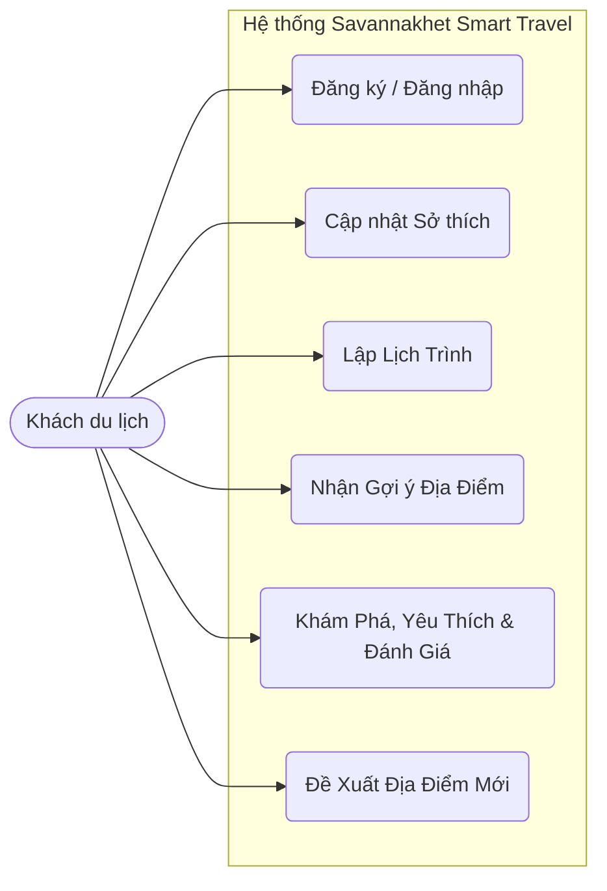
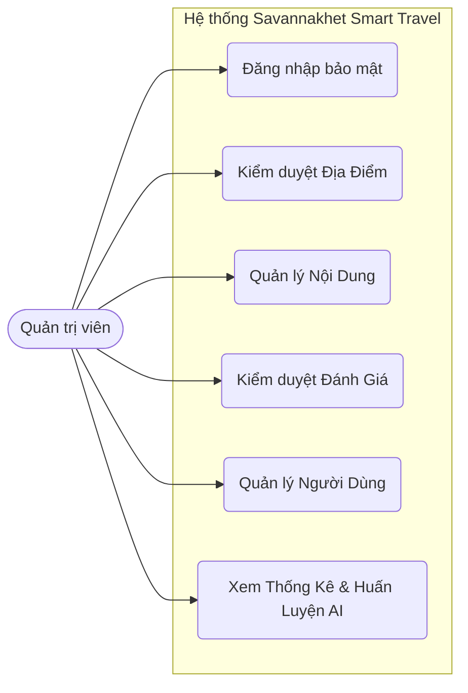
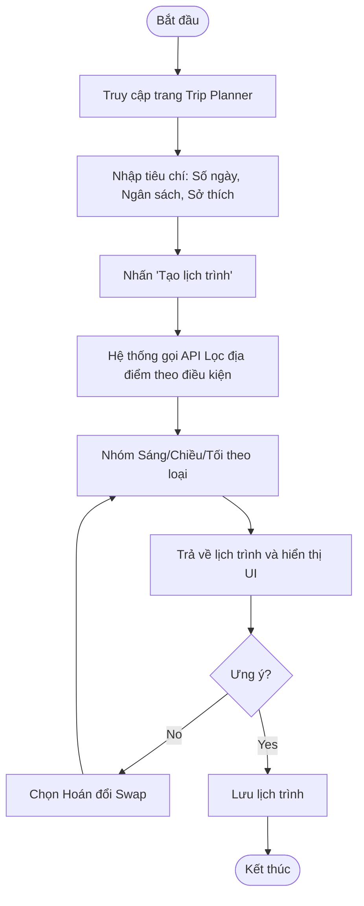
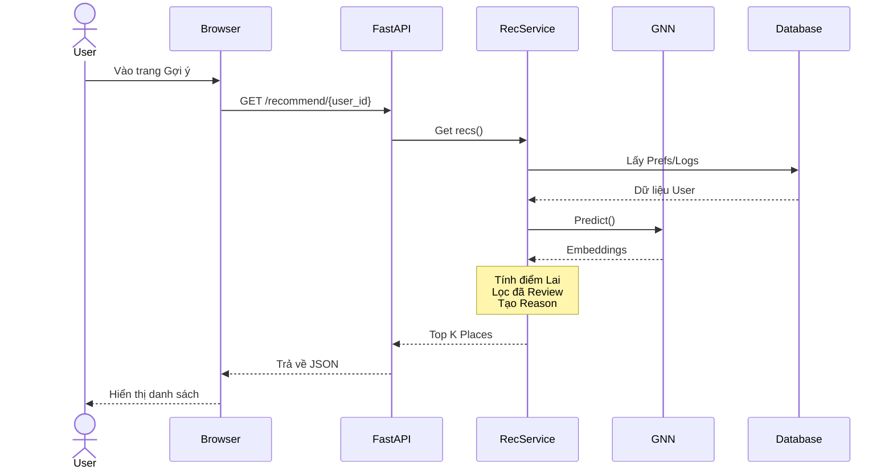
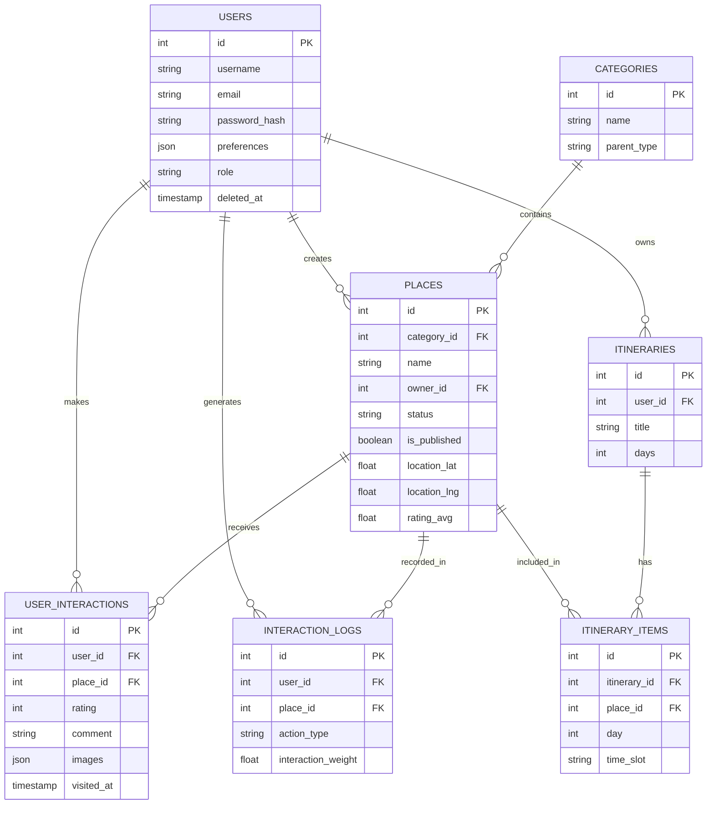

# CHƯƠNG 2: PHÂN TÍCH VÀ THIẾT KẾ HỆ THỐNG

## 2.1. Phân tích yêu cầu hệ thống

### 2.1.1. Mục tiêu của hệ thống

Hệ thống **Savannakhet Smart Travel** được phát triển nhằm số hóa và nâng cao trải nghiệm du lịch tại tỉnh Savannakhet, với các mục tiêu cốt lõi sau:

- **Gợi ý địa điểm thông minh (AI Recommendation):** Cung cấp các đề xuất địa điểm cá nhân hóa dựa trên sở thích và hành vi thông qua Mạng nơ-ron đồ thị (GNN) kết hợp phân tích nội dung (Content-Based).
- **Quản lý thông tin du lịch:** Lưu trữ và hiển thị chi tiết các địa điểm du lịch (khách sạn, nhà hàng, điểm tham quan, di tích...).
- **Tương tác cộng đồng:** Xây dựng không gian để khách du lịch chia sẻ trải nghiệm và tương tác qua đánh giá, bình luận.
- **Lập kế hoạch chuyến đi (Trip Planner):** Tự động tạo lịch trình du lịch tối ưu.
- **Quản trị hệ thống toàn diện:** Công cụ kiểm duyệt nội dung, quản lý người dùng và theo dõi thống kê hệ thống.
- **Đa ngôn ngữ:** Hỗ trợ tiếng Anh, tiếng Lào, tiếng Việt và tiếng Thái.

### 2.1.2. Đối tượng sử dụng

Hệ thống được thiết kế cho 2 nhóm đối tượng chính:

**Người dùng (User / Khách du lịch)**
- Tìm kiếm thông tin, nhận gợi ý AI, lên lịch trình, chia sẻ đánh giá.

**Quản trị viên (Admin)**
- Quản lý nội dung, duyệt địa điểm, quản lý tài khoản, theo dõi thống kê và kích hoạt huấn luyện hệ thống AI.

### 2.1.3. Yêu cầu chức năng

#### **Yêu cầu chức năng cho Người dùng (User)**
**Xác thực và Tài khoản:**
- Đăng nhập/Đăng ký với email và mật khẩu.
- Khôi phục mật khẩu (Forgot Password).
- Cập nhật hồ sơ cá nhân và thay đổi sở thích (Preferences) để tối ưu AI.

**Khám phá & Tương tác:**
- Xem và lọc danh sách địa điểm theo danh mục.
- Xem chi tiết thông tin, giờ mở cửa, và hình ảnh địa điểm.
- Lưu danh sách yêu thích (Favorites).
- Nhận danh sách Gợi ý cá nhân hóa từ AI.

**Cộng đồng:**
- Viết đánh giá (Review) kèm điểm số và hình ảnh.
- Bình luận, thích (Like) bài viết của người khác trên Community Feed.

**Lập lịch trình:**
- Tạo lịch trình tự động dựa trên: số ngày, ngân sách, tháng đi và sở thích.
- Hoán đổi địa điểm (Swap) theo buổi nếu không ưng ý.
- Lưu lại lịch trình cá nhân.

**Đóng góp nội dung:**
- Đề xuất thêm địa điểm mới (Submit Place - chờ duyệt).
- Yêu cầu cấp quyền đăng bài.

#### **Yêu cầu chức năng cho Quản trị viên (Admin)**
**Dashboard & Thống kê:**
- Thống kê tổng số lượng người dùng, địa điểm, bài đánh giá.
- Thống kê danh mục và địa điểm nổi bật.

**Quản lý Hệ thống & Nội dung:**
- Thêm/Sửa/Xóa địa điểm.
- Duyệt/Từ chối địa điểm do người dùng đề xuất (Pending Places).
- Quản lý danh mục (Categories) và gán phân loại gốc (parent_type) cho AI.
- Kiểm duyệt/xóa đánh giá, bình luận vi phạm.

**Quản lý Người dùng & AI:**
- Khóa/Mở tài khoản người dùng, duyệt quyền đăng bài.
- Kích hoạt quy trình huấn luyện lại mô hình GNN trực tiếp từ Dashboard.
- Xem và phản hồi tin nhắn liên hệ.
- Quản lý giao diện trang chủ (Hero Images).

### 2.1.4. Yêu cầu phi chức năng
**Hiệu năng:** Hệ thống phản hồi nhanh gọn, API chuẩn RESTful kết nối Frontend Vue.js và Backend FastAPI.
**Bảo mật:** Mật khẩu được mã hóa (bcrypt), xác thực bảo mật thông qua JWT Token.
**Khả năng sử dụng:** Giao diện trực quan, hỗ trợ thiết kế Responsive tốt trên cả điện thoại và máy tính.
**Khả năng giải thích (Explainable AI - XAI):** Hệ thống AI phải đi kèm lời giải thích rõ ràng bằng văn bản về lý do tại sao gợi ý địa điểm đó cho người dùng (Social Match / Content Match).

---

## 2.2. Phân tích chức năng

### 2.2.1. Chức năng xác thực
**Đăng nhập**
- User/Admin nhập Email và Password.
- Trả về mã JWT Token hợp lệ lưu trữ cục bộ.
- Phân quyền (Role-based access) bảo vệ các Endpoint của Admin.

### 2.2.2. Chức năng Lập lịch trình (Trip Planner)
- **Lấy thông tin đầu vào:** Người dùng nhập số ngày, tháng khởi hành, ngân sách, và sở thích.
- **Lọc địa điểm:** Lọc theo ngân sách, cộng thêm các trọng số nếu đi vào mùa khô/mưa.
- **Thuật toán sắp xếp Sáng/Chiều/Tối:** 
  - Sáng: Dành cho Thiên nhiên, Văn hóa, Di tích.
  - Chiều: Dành cho Cafe, Mua sắm, Di tích.
  - Tối: Dành cho Ẩm thực địa phương, Nhà hàng, Nightlife.
- **Lưu lịch trình:** Chuyển đổi dữ liệu và lưu vào cơ sở dữ liệu.

### 2.2.3. Chức năng Gợi ý AI (Recommendation)
- **Chuẩn bị dữ liệu:** Thu thập Vector Sở thích của User và Log lịch sử tương tác.
- **Truy vấn GNN:** Sử dụng Embedding sinh ra từ mô hình GraphSAGE đã huấn luyện.
- **Tính điểm (Hybrid Score):** 
  - Tính Cosine Similarity của đặc trưng GNN (Trọng số 60%).
  - Tính Content Similarity giữa Sở thích User và Danh mục Place (Trọng số 40%).
- **Lọc loại trừ:** Loại bỏ ngay lập tức những địa điểm mà người dùng đã từng đánh giá (Review) khỏi danh sách gợi ý để duy trì tính mới mẻ.

---

## 2.3. Sơ đồ Use Case

### 2.3.1. Sơ đồ Use Case cho Khách du lịch (User)

### 2.3.2. Sơ đồ Use Case cho Quản trị viên (Admin)

---

## 2.4. Biểu đồ hoạt động (Activity Diagram)

### 2.4.1. Quy trình Lập lịch trình du lịch (Trip Planner)

---

## 2.5. Biểu đồ tuần tự (Sequence Diagram)

### 2.5.1. Sequence Diagram: Gợi ý AI Cá nhân hóa

---

## 2.6. Thiết kế cơ sở dữ liệu

### 2.6.1. Sơ đồ ERD (Entity-Relationship Diagram)

### 2.6.2. Các bảng dữ liệu chính

#### **Bảng `users` (Người dùng)**
Lưu trữ thông tin tài khoản của khách du lịch và quản trị viên.

| Tên cột                    | Kiểu dữ liệu   | Ràng buộc | Mô tả                                                        |
| -------------------------- | -------------- | --------- | ------------------------------------------------------------ |
| **id**                     | INT            | PK, AI    | Khóa chính                                                   |
| **username**               | VARCHAR(255)   | Unique    | Tên đăng nhập                                                |
| **email**                  | VARCHAR(255)   | Unique    | Email liên hệ                                                |
| **password_hash**          | VARCHAR(255)   |           | Mật khẩu mã hóa (bcrypt)                                     |
| **preferences**            | JSON           |           | Sở thích du lịch (`["nature", "cafe"]`)                      |
| **role**                   | VARCHAR(50)    |           | Vai trò (`user`, `admin`)                                    |
| **post_permission_status** | VARCHAR(50)    |           | Trạng thái quyền đăng bài (`none`, `pending`, `approved`)    |

#### **Bảng `places` (Địa điểm du lịch)**
Lưu trữ thông tin chi tiết về các điểm đến.

| Tên cột              | Kiểu dữ liệu | Ràng buộc | Mô tả                                      |
| -------------------- | ------------ | --------- | ------------------------------------------ |
| **id**               | INT          | PK, AI    | Khóa chính                                 |
| **category_id**      | INT          | FK        | ID danh mục                                |
| **name**             | VARCHAR(255) |           | Tên địa điểm                               |
| **location_lat/lng** | FLOAT        |           | Tọa độ GPS                                 |
| **image_url**        | JSON         |           | Ảnh địa điểm                               |
| **status**           | VARCHAR(50)  |           | Trạng thái duyệt (`pending`, `approved`)   |
| **owner_id**         | INT          | FK        | ID người đề xuất (user_id)                 |
| **rating_avg**       | FLOAT        |           | Điểm đánh giá TB                           |
| **opening_hours**    | JSON         |           | Giờ mở cửa                                 |

#### **Bảng `categories` (Danh mục)**

| Tên cột         | Kiểu dữ liệu | Ràng buộc | Mô tả                                                        |
| --------------- | ------------ | --------- | ------------------------------------------------------------ |
| **id**          | INT          | PK, AI    | Khóa chính                                                   |
| **name**        | VARCHAR(100) |           | Tên danh mục (ví dụ: Hotel, Cafe)                            |
| **parent_type** | VARCHAR(100) |           | Nhóm danh mục lớn phục vụ AI (`nature`, `restaurant`...)     |

#### **Bảng `user_interactions` (Tương tác/Đánh giá)**
Lưu trữ Review để xây dựng cộng đồng.

| Tên cột      | Kiểu dữ liệu | Ràng buộc | Mô tả                         |
| ------------ | ------------ | --------- | ----------------------------- |
| **id**       | INT          | PK, AI    | Khóa chính                    |
| **user_id**  | INT          | FK        | Người đánh giá                |
| **place_id** | INT          | FK        | Địa điểm đánh giá             |
| **rating**   | INT          |           | Điểm (1-5)                    |
| **comment**  | TEXT         |           | Nội dung review               |
| **images**   | JSON         |           | Ảnh upload                    |

#### **Bảng `interaction_logs` (Nhật ký GNN)**
Lưu trữ nhật ký tương tác phục vụ AI.

| Tên cột                | Kiểu dữ liệu | Ràng buộc | Mô tả                                        |
| ---------------------- | ------------ | --------- | -------------------------------------------- |
| **id**                 | INT          | PK, AI    | Khóa chính                                   |
| **user_id**            | INT          | FK        | Người dùng                                   |
| **place_id**           | INT          | FK        | Địa điểm                                     |
| **action_type**        | VARCHAR(50)  |           | Loại hành động (`view`, `like`, `review`)    |
| **interaction_weight** | FLOAT        |           | Trọng số quy đổi                               |

#### **Bảng `itineraries` (Lịch trình chính)**
Lưu trữ lịch trình tự động.

| Tên cột      | Kiểu dữ liệu | Ràng buộc | Mô tả                    |
| ------------ | ------------ | --------- | ------------------------ |
| **id**       | INT          | PK, AI    | Khóa chính               |
| **user_id**  | INT          | FK        | Chủ sở hữu               |
| **title**    | VARCHAR(255) |           | Tên lịch trình           |
| **days**     | INT          |           | Số ngày đi               |

#### **Bảng `itinerary_items` (Chi tiết lịch trình)**

| Tên cột          | Kiểu dữ liệu | Ràng buộc | Mô tả                                        |
| ---------------- | ------------ | --------- | -------------------------------------------- |
| **id**           | INT          | PK, AI    | Khóa chính                                   |
| **itinerary_id** | INT          | FK        | Lịch trình cha                               |
| **day**          | INT          |           | Ngày thứ mấy                                 |
| **time_slot**    | VARCHAR(50)  |           | Buổi (Morning, Afternoon, Evening)           |
| **place_id**     | INT          | FK        | Địa điểm tham quan                           |
